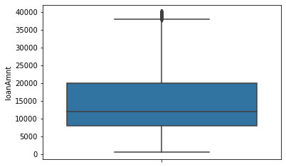

本学习笔记为阿里云天池龙珠计划金融风控训练营的学习内容，学习链接为：https://tianchi.aliyun.com/specials/activity/promotion/aicampfr
# 一、学习知识点概要
- 特征预处理、缺失值、异常值处理、数据分桶等特征处理方法
- 特征交互、编码、选择的相应方法

# 二、学习内容


```python
#导包
import pandas as pd
import seaborn as sns
from tqdm import tqdm
from sklearn.preprocessing import LabelEncoder
import warnings
warnings.filterwarnings('ignore')

#读取数据
data_train =pd.read_csv('data/train.csv',)
data_testA = pd.read_csv('data/testA.csv')

#分离标签
# x_train=data_train.drop(['id','isDefault'],axis=1)
# x_test=data_testA.drop('id',axis=1)
# y_train=data_train['isDefault']

#分离特征
numerical_fea=list(data_train.select_dtypes(exclude=['object']).columns)
category_fea=['grade', 'subGrade', 'employmentTitle', 'homeOwnership', 'verificationStatus', 'purpose', 'postCode', 'regionCode','applicationType', 'initialListStatus', 'title', 'policyCode']
numerical_fea.remove('id')
numerical_fea.remove('isDefault')
```

## 1 数据预处理
在比赛中数据预处理是必不可少的一部分，对于缺失值的填充往往会影响比赛的结果，在比赛中不妨尝试多种填充然后比较结果选择结果最优的一种； 比赛数据相比真实场景的数据相对要“干净”一些，但是还是会有一定的“脏”数据存在，清洗一些异常值往往会获得意想不到的效果。

### 1.1 缺失值处理

#### 1.1.1 删除
```python
data_train.dropna()
#参数
#inplace:bool   是否原地进行操作
```

#### 1.1.2 填充
```python
data_train.fillna()
#参数
#value:any      填充数值
#inplace:bool   是否原地进行操作
#limit:int      最多填充连续的缺失值数量
#method:str     填充方式
```
- 填充0
```python
data_train.fillna(value=0,inplace=True)
```
- 填充空值上方的值
```python
data_train.fillna(axis=0,method='ffill',inplace=True)
```
- 纵向用缺失值下面的值替换缺失值
```python
data_train.fillna(axis=0,method='bfill',inplace=True)
```


```python
#按照平均数填充数值型特征
data_train[numerical_fea]=data_train[numerical_fea].fillna(value=data_train[numerical_fea].median())
data_testA[numerical_fea]=data_testA[numerical_fea].fillna(value=data_train[numerical_fea].median())
#按照众数填充类别型特征
data_train[category_fea]=data_train[category_fea].fillna(value=data_train[numerical_fea].median())
data_testA[category_fea]=data_testA[category_fea].fillna(value=data_train[numerical_fea].median())
data_train.isnull().sum()
```


    id                        0
    loanAmnt                  0
    term                      0
    interestRate              0
    installment               0
    grade                     0
    subGrade                  0
    employmentTitle           0
    employmentLength      46799
    homeOwnership             0
    annualIncome              0
    verificationStatus        0
    issueDate                 0
    isDefault                 0
    purpose                   0
    postCode                  0
    regionCode                0
    dti                       0
    delinquency_2years        0
    ficoRangeLow              0
    ficoRangeHigh             0
    openAcc                   0
    pubRec                    0
    pubRecBankruptcies        0
    revolBal                  0
    revolUtil                 0
    totalAcc                  0
    initialListStatus         0
    applicationType           0
    earliesCreditLine         0
    title                     0
    policyCode                0
    n0                        0
    n1                        0
    n2                        0
    n3                        0
    n4                        0
    n5                        0
    n6                        0
    n7                        0
    n8                        0
    n9                        0
    n10                       0
    n11                       0
    n12                       0
    n13                       0
    n14                       0
    dtype: int64


### 1.2 异常值处理

#### 1.2.1箱型图
界外的点将被识别为异常值


```python
sns.boxplot(y='loanAmnt',data=data_train)
```


    <AxesSubplot:ylabel='loanAmnt'>


    

    


#### 1.2.1均方差检验
在统计学中，如果一个数据分布近似正态$\xi\text{~}N(\mu,\sigma^2)$，那么大约 68% 的数据值会在均值的一个标准差$\sigma$范围内，大约 95% 会在两个$\sigma$范围内，大约 99.7% 会在三个$\sigma$范围内。


```python
def drop_outliers_by_3sigma(data,fea_list):
    for fea in fea_list:
        std=data[fea].std()
        mean=data[fea].mean()
        outliers_cut_off = std * 3
        lower_rule = mean - outliers_cut_off
        upper_rule = mean + outliers_cut_off
        data=data[data[fea].apply(lambda x:upper_rule >= x >= lower_rule)].dropna()
    del fea
    return data
data_train=drop_outliers_by_3sigma(data_train,numerical_fea)
```

## 2 特征预处理

### 2.1 类别型特征编码
需要对将各样的类别型数据转换成数值型类别
- 时间格式处理
（但实际'issueDate'特征对标记是无任何影响的）
```python
for data in [data_train, data_testA]:
    data['issueDate'] = pd.to_datetime(data['issueDate'],format='%Y-%m-%d')
    start_date = datetime.datetime.strptime('2007-06-01', '%Y-%m-%d')
    #构造时间特征
    data['issueDate'] = data['issueDate'].apply(lambda x: x-start_date).dt.days
```

- 其他格式


```python
for data in [data_train, data_testA]:
    data['grade'].replace({'A':1,'B':2,'C':3,'D':4,'E':5,'F':6,'G':7},inplace=True)
    data['employmentLength'].replace({'10+ years':10,'9 years':9,'8 years':8,'7 years':7,'6 years':6,'5 years':5,'4 years':4,'3 years':3,'2 years':2,'1 year':1,'< 1 year':0},inplace=True)
    data['earliesCreditLine'] = data['earliesCreditLine'].apply(lambda s: int(s[-4:]))
    data = pd.get_dummies(data, columns=['subGrade', 'homeOwnership', 'verificationStatus', 'purpose', 'regionCode'], drop_first=True)
del data
for col in tqdm(['employmentTitle', 'postCode', 'title','subGrade']):
    le = LabelEncoder()
    le.fit(list(data_train[col].astype(str).values) + list(data_testA[col].astype(str).values))
    data_train[col] = le.transform(list(data_train[col].astype(str).values))
    data_testA[col] = le.transform(list(data_testA[col].astype(str).values))

```

    100%|██████████| 4/4 [00:04<00:00,  1.04s/it]
    

### 2.2 特征分箱
- 目的：
    - 从模型效果上来看，特征分箱主要是为了降低变量的复杂性，减少变量噪音对模型的影响，提高自变量和因变量的相关度。从而使模型更加稳定.
- 对象：
    - 将连续变量离散化.
    - 将多状态的离散变量合并成少状态.
- 分箱的原因：
    - 数据的特征内的值跨度可能比较大，对有监督和无监督中如k-均值聚类它使用欧氏距离作为相似度函数来测量数据点之间的相似度. 都会造成大吃小的影响，其中一种解决方法是对计数值进行区间量化即数据分桶也叫做数据分箱，然后使用量化后的结果.
- 分箱的优点：
    - 处理缺失值：当数据源可能存在缺失值，此时可以把null单独作为一个分箱。
    - 处理异常值：当数据中存在离群点时，可以把其通过分箱离散化处理，从而提高变量的鲁棒性（抗干扰能力）. 例如，age若出现200这种异常值，可分入“age > 60”这个分箱里，排除影响.
业务解释性：我们习惯于线性判断变量的作用，当x越来越大，y就越来越大。但实际x与y之间经常存在着非线性关系，此时可经过WOE变换.
- 特别要注意一下分箱的基本原则：
    - 最小分箱占比不低于5%.
    - 箱内不能全部是同一标记.
    - 连续箱单调.

#### 2.2.1 无监督分箱
- 等距分箱

    从最小值到最大值之间,均分为$N$等份，这样，如果$A,B$为最小最大值，则每个区间的长度为$W=\frac{B-A}{N}$，则区间边界值为$A+W,A+2W,\cdots,A+(N-1)W$.
这里只考虑边界，每个等份里面的实例数量可能不等.
```python
## 通过对数函数映射到指数宽度分箱
data['loanAmnt_bin'] = np.floor(np.log10(data['loanAmnt']))
```
- 等频分箱
    区间的边界值要经过选择,使得每个区间包含大致相等的实例数量。比如说$N=10$ ,每个区间应该包含大约$10\%$的实例。

#### 2.2.2 有监督分箱
- 卡方分箱
    自底向上的(即基于合并的)数据离散化方法. 它依赖于卡方检验:具有最小卡方值的相邻区间合并在一起,直到满足确定的停止准则.
    - 基本思想:
      对于精确的离散化，相对类频率在一个区间内应当完全一致。因此,如果两个相邻的区间具有非常类似的类分布，则这两个区间可以合并；否则，它们应当保持分开。而低卡方值表明它们具有相似的类分布。
    - 卡方阈值的确定：
    根据显著性水平和自由度得到卡方值自由度比类别数量小1。
    - 阈值的意义:
    类别和属性独立时,有90%的可能性,计算得到的卡方值会小于4.6。 大于阈值4.6的卡方值就说明属性和类不是相互独立的，不能合并。如果阈值选的大,区间合并就会进行很多次,离散后的区间数量少、区间大。

    注：
        - 1 ChiMerge算法推荐使用0.90、0.95、0.99置信度,最大区间数取10到15之间.
        - 2 也可以不考虑卡方阈值,此时可以考虑最小区间数或者最大区间数。指定区间数量的上限和下限,最多几个区间,最少几个区间。
        - 3 对于类别型变量,需要分箱时需要按照某种方式进行排序。

### 2.3 特征交互
- 交互特征的构造非常简单，使用起来却代价不菲. 如果线性模型中包含有交互特征对，那它的训练时间和评分时间就会从$O(n)$增加到$O(n^2)$，其中$n$是单一特征的数量。
```python
for col in ['grade', 'subGrade']:
    temp_dict = data_train.groupby([col])['isDefault'].agg(['mean']).reset_index().rename(columns={'mean': col + '_target_mean'})
    temp_dict.index = temp_dict[col].values
    temp_dict = temp_dict[col + '_target_mean'].to_dict()
    data_train[col + '_target_mean'] = data_train[col].map(temp_dict)
    data_test_a[col + '_target_mean'] = data_test_a[col].map(temp_dict)
```
```python
# 其他衍生变量 mean 和 std
for df in [data_train, data_test_a]:
    for item in ['n0','n1','n2','n4','n5','n6','n7','n8','n9','n10','n11','n12','n13','n14']:
        df['grade_to_mean_' + item] = df['grade'] / df.groupby([item])['grade'].transform('mean')
        df['grade_to_std_' + item] = df['grade'] / df.groupby([item])['grade'].transform('std')
```

## 3 特征选择
- 特征选择技术可以精简掉无用的特征，以降低最终模型的复杂性，它的最终目的是得到一个简约模型，在不降低预测准确率或对预测准确率影响不大的情况下提高计算速度. 特征选择不是为了减少训练时间（实际上，一些技术会增加总体训练时间），而是为了减少模型评分时间.
特征选择方法
- 1 Filter
    - 方差选择法
    - 相关系数法（pearson 相关系数）
    - 卡方检验
    - 互信息法
- 2 Wrapper （RFE）
    - 递归特征消除法
- 3 Embedded
    - 基于惩罚项的特征选择法
    - 基于树模型的特征选择

### 3.1 Filter
- 基于特征间的关系进行筛选

#### 3.1.1 方差选择法
- 方差选择法中，先要计算各个特征的方差，然后根据设定的阈值，选择方差大于阈值的特征
```python
from sklearn.feature_selection import VarianceThreshold
#其中参数threshold为方差的阈值
VarianceThreshold(threshold=3).fit_transform(x_train,y_train)
```

#### 3.1.2 相关系数法
- Pearson皮尔森相关系数是一种最简单的，可以帮助理解特征和响应变量之间关系的方法，该方法衡量的是变量之间的线性相关性. 结果的取值区间为$[-1，1]$，$-1$表示完全的负相关，$+1$表示完全的正相关，$0$表示没有线性相关.
```python
from sklearn.feature_selection import SelectKBest
from scipy.stats import pearsonr
#选择k个最好的特征，返回选择特征后的数据
#第一个参数为计算评估特征是否好的函数，该函数输入特征矩阵和目标向量，
#输出二元组（评分，P值）的数组，数组第i项为第i个特征的评分和P值。在此定义为计算相关系数
#参数k为选择的特征个数
SelectKBest(k=5).fit_transform(x_train,y_train)
```

#### 3.1.3 卡方检验
- 经典的卡方检验是用于检验自变量对因变量的相关性. 假设自变量有$N$种取值，因变量有$M$种取值，考虑自变量等于$i$且因变量等于$j$的样本频数的观察值与期望的差距. 其统计量如下： $\chi^2=\sum\frac{(A-E)^2}{E}$，其中$A$为实际值，$T$为理论值

    (注：卡方只能运用在正定矩阵上，否则会报错Input X must be non-negative)
```python
from sklearn.feature_selection import SelectKBest
from sklearn.feature_selection import chi2
#参数k为选择的特征个数
SelectKBest(chi2, k=5).fit_transform(x_train,y_train)
```

#### 3.1.4 互信息法
- 经典的互信息也是评价自变量对因变量的相关性的. 在feature_selection库的SelectKBest类结合最大信息系数法可以用于选择特征.
```python
from sklearn.feature_selection import SelectKBest
from minepy import MINE
#由于MINE的设计不是函数式的，定义mic方法将其为函数式的，
#返回一个二元组，二元组的第2项设置成固定的P值0.5
def mic(x, y):
    m = MINE()
    m.compute_score(x, y)
    return (m.mic(), 0.5)
#参数k为选择的特征个数
SelectKBest(lambda X, Y: array(map(lambda x:mic(x, Y), X.T)).T, k=2).fit_transform(x_train,y_train)
```

### 3.2 Wrapper （Recursive feature elimination，RFE）

#### 3.2.1 递归特征消除法
- 递归消除特征法使用一个基模型来进行多轮训练，每轮训练后，消除若干权值系数的特征，再基于新的特征集进行下一轮训练. 在feature_selection库的RFE类可以用于选择特征.
```python
#以逻辑回归作为基模型的特征选择
from sklearn.feature_selection import RFE
from sklearn.linear_model import LogisticRegression
#递归特征消除法，返回特征选择后的数据
#参数estimator为基模型
#参数n_features_to_select为选择的特征个数
RFE(estimator=LogisticRegression(), n_features_to_select=2).fit_transform(x_train,y_train)
```

### 3.3 Embedded

#### 3.3.1 基于惩罚项的特征选择法
- 使用带惩罚项的基模型，除了筛选出特征外，同时也进行了降维.在feature_selection库的SelectFromModel类可以用于选择特征.
```python
#以逻辑回归作为基模型的特征选择
from sklearn.feature_selection import SelectFromModel
from sklearn.linear_model import LogisticRegression
#带L1惩罚项的逻辑回归作为基模型的特征选择
SelectFromModel(LogisticRegression(penalty="l1", C=0.1)).fit_transform(x_train,y_train)
```

#### 3.3.2 基于树模型的特征选择
- 树模型中GBDT也可用来作为基模型进行特征选择. 在feature_selection库的SelectFromModel类可以用于选择特征.
```python
#以GBDT作为基模型的特征选择
from sklearn.feature_selection import SelectFromModel
from sklearn.ensemble import GradientBoostingClassifier
SelectFromModel(GradientBoostingClassifier()).fit_transform(x_train,y_train)
```

# 三、学习问题与解答
- 填充空值的时候无法原地进行

# 四、学习思考与总结
特征工程是机器学习，甚至是深度学习中最为重要的一部分，在实际应用中往往也是所花费时间最多的一步. 但各种算法书中对特征工程部分的讲解往往少得可怜，因为特征工程和具体的数据结合的太紧密，很难系统地覆盖所有场景.
本次学到的缺失值异常值的处理方法详细对任何数据集来说都是适用的.但对于分箱等操作则需要对症下药具体问题具体分析.在特征工程中比赛和具体的应用还是有所不同的，在实际的金融风控评分卡制作过程中，由于强调特征的可解释性，特征分箱尤其重要.
